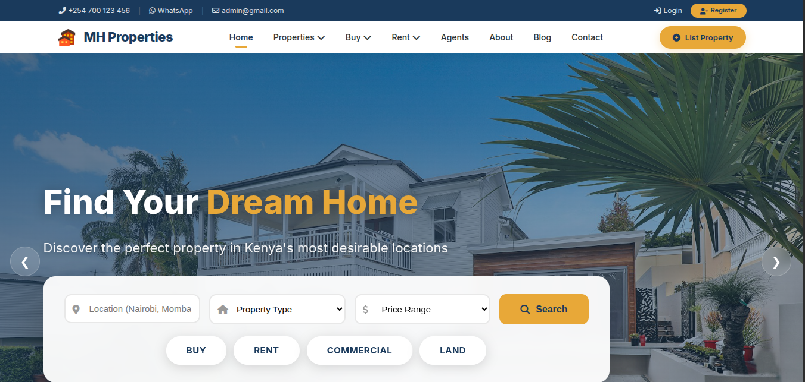
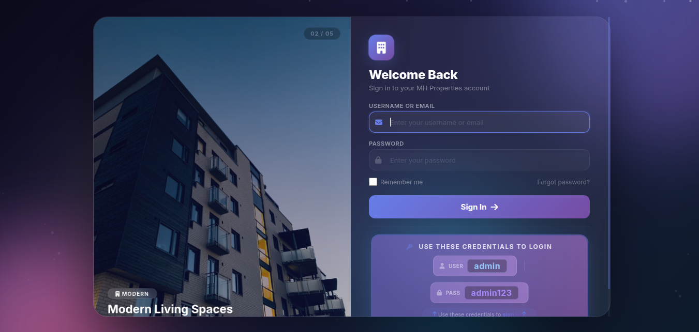
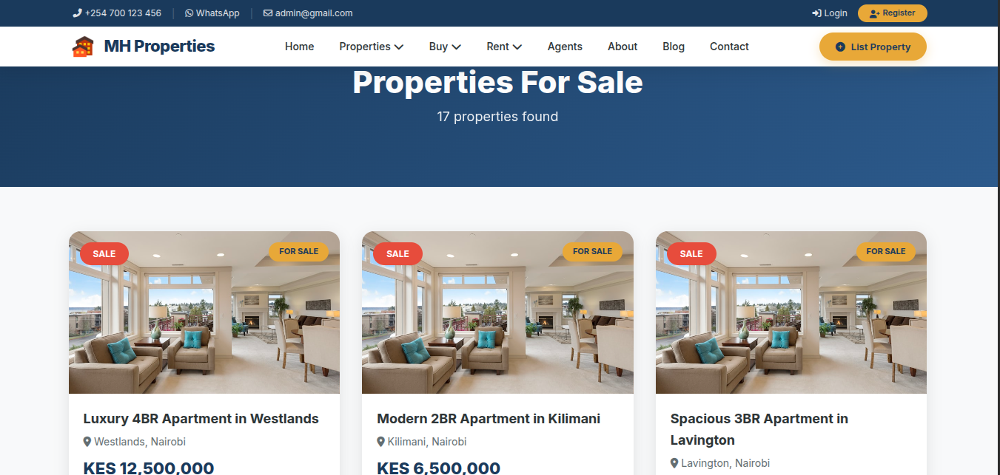
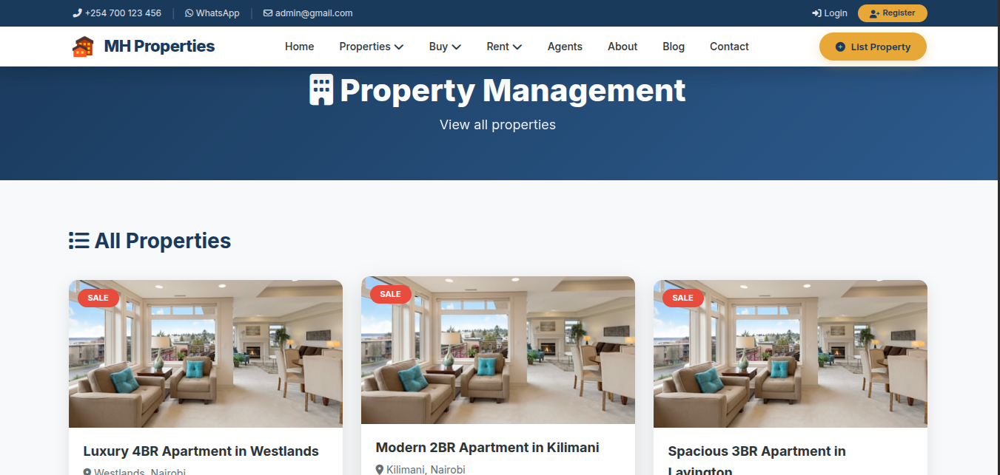
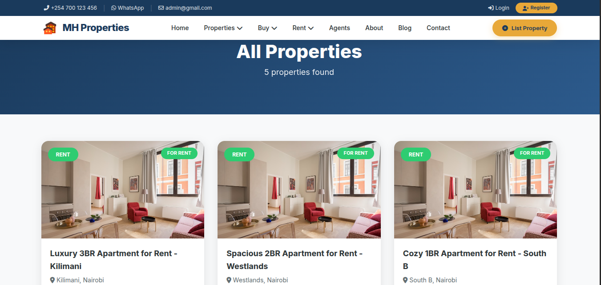

# 🏠 Real Estate Website

## 🌐 Live Demo
**[View Live Website](http://michaelphotofolio.atwebpages.com/realestate/)**

> Click the link above to see the live version of this real estate website!

---

## 📸 Website Screenshots

  
### 🏠 Homepage

  

### 🔐 Login Page

  

### 🏡 Properties Page

  

### ⚙️ Property Management

  

### 💰 Rent Page

---

## 📋 About This Project

A fully functional real estate property listing website built with PHP, MySQL, HTML, CSS, and JavaScript. This platform allows users to browse properties, search for listings, and manage real estate inquiries efficiently.

### ✨ Key Features:
- 🔍 **Property Search & Filtering** - Advanced search with filters
- 📋 **Property Listings** - Detailed property listings with high-quality images
- 👤 **User Authentication** - Registration and login system
- 📱 **Responsive Design** - Fully responsive on all devices
- 📧 **Contact Forms** - Property inquiry and contact forms
- 🏷️ **Property Categories** - Organized by type, location, and price
- 🔐 **Admin Panel** - Complete management dashboard
- 💰 **Rent & Sale Options** - Both rental and purchase listings
- 🖼️ **Image Gallery** - Multiple images per property
- 📊 **Property Management** - Add, edit, and delete listings

---

## 🛠️ Technologies Used

### Frontend:
- HTML5
- CSS3
- JavaScript
- Bootstrap 5

### Backend:
- PHP
- MySQL Database
- PDO for database connections

### Server:
- Apache (AwardSpace)

### Tools:
- Git & GitHub for version control
- cPanel for hosting management

---

## 📁 Project Structure
